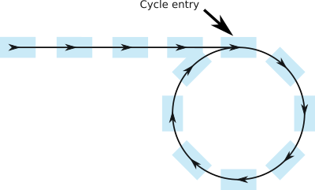
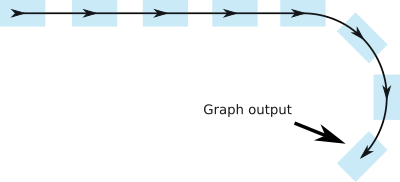

# Cycle Detection

Your data model has entities that can have references to itself. For instance a
parent which can have a parent, and so on, up to the root. But wait, is there a
root? How can you be sure that you won't fall into an infinite cycle by walking
in the graph? You can answer this question by using the Floyd cycle detection
algorithm.

Launch a turtle and a hare on the same path. The hare runs twice as fast as the
turtle. If the two cross again, then there is a loop in the path:

If there is no loop, you can expect there is an output in the graph:

